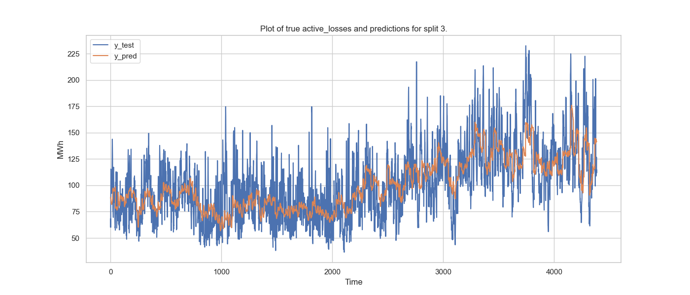

# Approach to work on the ML Engineer Challenge - Swissgrid

## Main steps for solving the task:

1. Understand the nature of the data and the objective
2. Understand the approach of the group 3 to solve the tas
3. Note all the functionnalities implemented 
4. Define the structure of the code
5. Implement the various functionnalities in the various submodules and test them against original notebook
6. Write the main file to allow to run the entire process 
7. Rewrite the code for feature engineering into a clearer class 
8. Add a function to visualize forecasting

## Main good practices to follow:

### 1.Setting up a virtual environment 
Allows to manage project dependencies and packages properly. An environment.yaml file is created for easily exporting the active_loss virtual environment.

### 2.Setting up version control
Setting up of a git repository with best parctices, including rergular commits with relevant messages.

### 3.Code structure
**file structure:** establishing a clear and intuitive file structure with related files grouped together.
**modularization:** Brezk down the previous notebook code into modular compenents. The goal is to improve code organization, readibility and reusability

### 4.Code documentation
**comments in the code:** ensure that the main different steps in the code are commented and write small description for each function, class for easier understanding 
**README.py** it should: describe the project, explain how to set up the virtual env and showcase the structure of the code / data

### 5.Implement logging
Ensure to save important metrics, models, hyperparameters and other relevant details. 
Output informational messages during the execution of the program for better undesrtanding and debugging

## Features added:

### FeatureEngineer() class:
Writting the FeatureEngineer class allowed better encapsulation of all functions (methods) for the creation of the different new features (time, dates, lags...). Defining all the methods in the same class gives a better understanding of all the features added and enables more modularrity in the future.

### visualize_model_predictions() function:
Different stakeholders being higly interested in the predictions from this model implementation I felt like it was missing a simple function to visualize the accuracy of the forecast from the model. Once the splits are obtained from the preprocessed data and the preprocessor trained, the fucntion does the following:
- train a ElasticNet model using the previously best found hyperparameters
- get the prediction from the testing data
- plot the active loss predictions and true historical value 
- save those plots to /plots folder
Here is an example of plot:

## Potential additionnal work:
Due to time constraint some good practices could not be implemented. Here is a non-exhaustive list of the the future work that could be done to ensure a more maintanable and adaptable code:
1. **Implement testing:** unit testing for functions and modules, integration testing between different componenents of the code
2. **Implement command-line argument parsing:** allowing for better adaptivity for the code. Being able to run more easily the code with different data, model, hyperparameters...
3. **Implement configurations:** allows to quickly run the code with different configs 

## Feedback:

### Postive:
- very interesting subject on a real-world situation
- open objectives that allows to come up with our own implementation of the solution
- easy to run notebooks and very manageable data

### Less positive:
- hard not to spend more than 6 hours on it to give a more finished solution